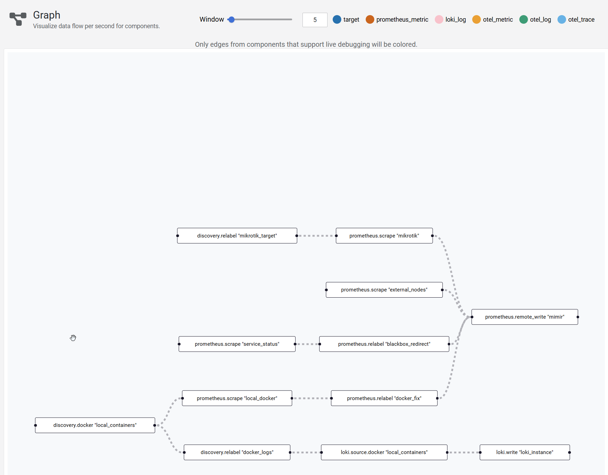

# grafana

1.  Stack grafany do monitoringu homelaba
2.  Graf:

3.  Komponenty:  

    [x] grafana  

    [x] alloy  

    [x] loki  

    [x] prometheus  

    [x] mimir
4. Grafana monitoruje kluster kubernetes i docker jak również sieć opartą o mikrotika. Cała konfiguracja opiera się o plik config.alloy